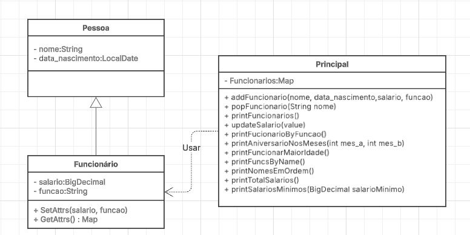

# Processo Seletivo
Este repositório contém o desafio de um processo seletivo da Projedata. Ele foi desenvolvido utilizando Java 21.0.6, e aqui você encontra os detalhes do projeto, decisões tomadas e a estrutura implementada.

## Como executar localmente
Este projeto foi criado utilizando Java 21.0.6. Para rodar localmente, siga os passos abaixo:

### 1. Clone o Repositório
```
git clone https://github.com/seu-usuario/nome-do-repositorio.git
```
### 2. Instale as Dependências
O projeto utiliza Maven como ferramenta de gerenciamento de dependências e build. Certifique-se de que o Maven esteja instalado no seu sistema. <br>
navegue até o diretório do projeto e execute o seguinte comando para instalar as dependências:

```
mvn clean install
```

### 3. Execute o Projeto
Após a instalação das dependências, você pode executar o projeto com o Maven:
```
mvn exec:java
```

## Diagrama de Classes
Para facilitar a criação da estrutura e a implementação das funcionalidades, foi criado um diagrama de classes que descreve as entidades principais do projeto.

### Principais Classes
- **Pessoa**: Classe base que contém os atributos comuns a todas as pessoas.
- **Funcionário**: Herda da classe Pessoa e adiciona características específicas de um funcionário.
- **Principal**: Classe que contém as operações principais do sistema, como a manipulação de objetos Funcionário.


## Estrutura
- **core**: Possui a classe Principal e as funcionalidades.
- **models**: Possui os modelos que representam entidades.
- **utils**: Possui recursos reutilizados ao longo do sistema.
- **resources**: arquivos utilizados, no caso o arquivo de entrada com os funcionários.


